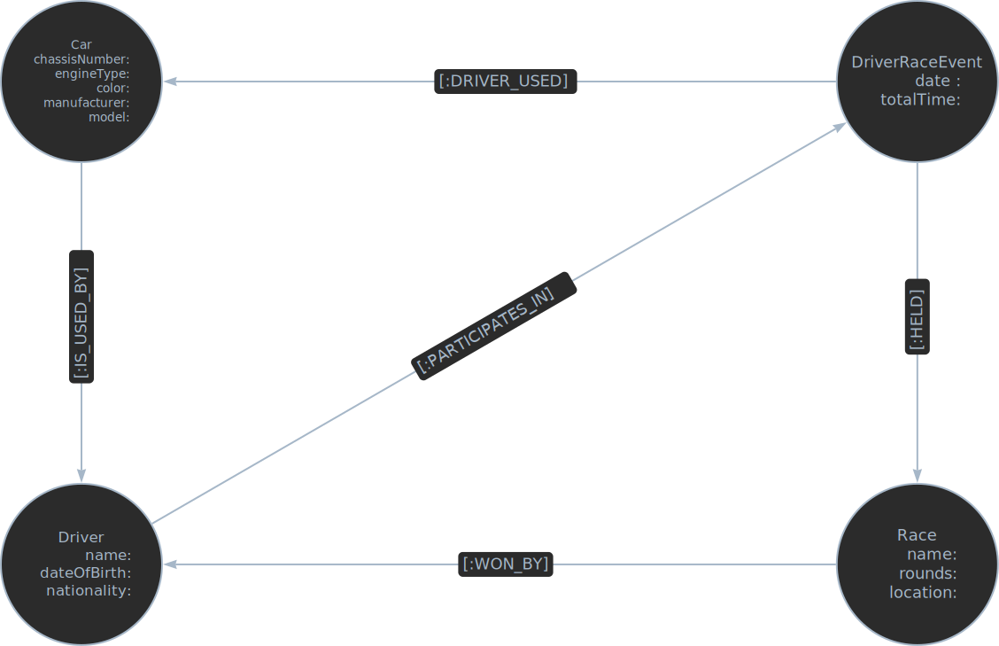

# Neo4j Docker Setup

This repository contains instructions and files to set up a Neo4j environment using Docker.

### Prerequisites

- Docker Desktop installed on your machine. You can download it from [Docker's official website](https://www.docker.com/products/docker-desktop).

### Steps to Run

1. **Clone the Repository**
   Clone this repository to your local machine:

   ```bash
   git clone https://github.com/GiannisKarampinis/neo4j-demo
   cd neo4j-demo
   ```

2. **Build the Docker Image**
   docker build -t neo4j-demo .

3. **Run Neo4j container**
   docker run -d --name neo4j-container -p 7474:7474 -p 7687:7687 neo4j-demo

4. **Access Neo4j Browser App**
   Open a web browser and go to http://localhost:7474

5. **Initialize Database**
   Execute :play movies (1st Set of queries) or :play northwind-graph (2nd set of queries)

<br>
<br>
<br>

# 1st Set of Neo4j Cypher Queries

1. **Find actors who have acted in movies released after 2000 and whose name starts with "M" or played the role of "Neo":**

   ```cypher
   MATCH (p:Person)-[r:ACTED_IN]->(m:Movie)
   WHERE m.released > 2000 AND (p.name STARTS WITH "M" OR "Neo" IN r.roles)
   RETURN p
   ```

2. **Find people who have both acted in and directed the same movie, showing their names and the movie title:**

   ```cypher
   MATCH (p:Person)-[:ACTED_IN]->(m:Movie)
   WHERE (p)-[:DIRECTED]->(m)
   RETURN p.name, m.title
   ```

   ```cypher
   MATCH (p:Person)-[:ACTED_IN]->(m:Movie)<-[:DIRECTED]-(p:Person) RETURN p.name, m.title
   ```

   ```cypher
   MATCH (p:Person)-[:ACTED_IN]->(m:Movie), (p)-[:DIRECTED]->(m) RETURN p.name, m.title
   ```

3. **Find directors who have never acted in any movie:**

   ```cypher
   MATCH (p:Person)-[:DIRECTED]->(m:Movie)
   WHERE NOT (p)-[:ACTED_IN]->()
   RETURN DISTINCT p.name
   ```

   ```cypher
   MATCH (p:Person)-[:DIRECTED]->(m:Movie)
   WHERE NOT (p)-[:ACTED_IN]->(:Movie)
   RETURN DISTINCT p
   ```

4. **Display the number of movies each actor who acted in "The Matrix" has played in, sorted in descending order:**

   ```cypher
   MATCH (:Movie { title: "The Matrix" })<-[:ACTED_IN]-(actor)-[:ACTED_IN]->(movie)
   RETURN actor.name, COUNT(*) AS count
   ORDER BY count DESC
   ```

   ```cypher
   MATCH (p:Person)-[:ACTED_IN]->(:Movie {title: "The Matrix"}),
   (p)-[:ACTED_IN]->(m:Movie)
   RETURN p.name, COUNT(*) AS count
   ORDER BY count DESC
   ```

5. **Count actors born between 1955 and 1975 per movie:**

   ```cypher
   MATCH (p)-[:ACTED_IN]->(m)
   WHERE p.born >= 1955 AND p.born <= 1975
   RETURN m.title, COUNT(*) AS count
   ```

6. **Find the movie with the most actors:**

   ```cypher
   MATCH (m:Movie)<-[:ACTED_IN]-(p:Person)
   WITH m, COUNT(p) AS played
   RETURN m.title, played
   ORDER BY played DESC
   LIMIT 1
   ```

   ```cypher
   MATCH (p:Person)-[:ACTED_IN]->(m:Movie) RETURN m.title, COUNT (*) AS cnt ORDER BY cnt DESC LIMIT 1
   ```

7. **Actors who have acted in "Snow Falling on Cedars" or "The Green Mile", including the movies they acted in:**

   ```cypher
   MATCH (p)-[:ACTED_IN]->(m)
   WHERE m.title="Snow Falling on Cedars" OR m.title="The Green Mile"
   RETURN m, p
   ```

8. **Movies in which both Keanu Reeves and Hugo Weaving have acted:**

   ```cypher
   MATCH (p1:Person { name: "Keanu Reeves" })-[:ACTED_IN]->(m)<-[:ACTED_IN]-(p2:Person { name: "Hugo Weaving" }) RETURN p1, p2, m
   RETURN m
   ```

9. **Actors who have never acted in any movie that Keanu Reeves or Tom Hanks have acted in:**

   ```cypher
   MATCH (p:Person)
   WHERE NOT (p)-[:ACTED_IN]->()<-[:ACTED_IN]-(:Person { name:"Keanu Reeves" })
     AND NOT (p)-[:ACTED_IN]->()<-[:ACTED_IN]-(:Person { name:"Tom Hanks" })
   AND p.name <> "Keanu Reeves" AND p.name <> "Tom Hanks"
   RETURN DISTINCT p.name
   ```

10. **Actors who have acted in at least 3 movies, sorted by the number of movies:**

    ```cypher
    MATCH (p:Person)-[:ACTED_IN]->(m:Movie)
    WITH p, COUNT(*) AS played
    WHERE played >= 3
    RETURN p.name, played
    ORDER BY played DESC
    ```

11. **Number of actors in each movie where at least one actor has acted in "A Few Good Men", ordered by the number of actors:**

    ```cypher
    MATCH (:Movie { title:"A Few Good Men" })<-[:ACTED_IN]-(p:Person)-[:ACTED_IN]->(m:Movie)<-[:ACTED_IN]-(p1:Person)
    RETURN m.title, COUNT(DISTINCT p1) AS played
    ORDER BY played DESC
    ```

12. **Pairs of actors who have acted together in at least two movies:**

    ```cypher
    MATCH (m1)<-[:ACTED_IN]-(p:Person)-[:ACTED_IN]->(m)<-[:ACTED_IN]-(p1:Person)-[:ACTED_IN]->(m1)
    WHERE p.name < p1.name
    RETURN DISTINCT p.name, p1.name
    ```

13. **Shortest path length from Tom Hanks to each actor:**

    ```cypher
    MATCH p=shortestPath((tom:Person { name:"Tom Hanks" })-[*]-(p1:Person))
    WHERE p1 <> tom
    RETURN p1.name, length(p)
    ```

14. **Pairs of people and movies where a person is connected with at least two different types of relationships with the movie:**

    ```cypher
    MATCH (p:Person)-[relatedTo]-(m:Movie)
    WITH p, m, COUNT(DISTINCT TYPE(relatedTo)) AS types
    WHERE types >= 2
    RETURN p.name, m.title, types
    ```

15. **All nodes of type Person:**

    ```cypher
    MATCH (n:Person)
    RETURN n
    ```

16. **Movies in which Tom Hanks has acted with either Meg Ryan or Kevin Bacon:**

    ```cypher
    MATCH (p:Person { name:'Tom Hanks' })-[:ACTED_IN]->(m)<-[:ACTED_IN]-(:Person { name:'Meg Ryan' })
    RETURN m
    UNION
    MATCH (:Person { name:'Tom Hanks' })-[:ACTED_IN]->(m)<-[:ACTED_IN]-(:Person { name:'Kevin Bacon' })
    RETURN m
    ```

17. **People who have never acted in any movie:**

    ```cypher
    MATCH (p:Person)
    WHERE NOT (p)-[:ACTED_IN]->(:Movie)
    RETURN p
    ```

18. **Nodes that are at most 3 hops away from both Tom Hanks and Keanu Reeves:**

    ```cypher
    MATCH (p2 { name:'Keanu Reeves' })-[*1..3]-(p)-[*1..3]-(p1 { name:'Tom Hanks' })
    RETURN p
    ```

    ```cypher
    MATCH (p2 { name:'Keanu Reeves' })-[*1..3]-(p), (p1 { name:'Tom Hanks' })-[*1..3]-(p)
    RETURN p
    ```

19. **People who have either written or directed a movie released after 1970, including the movies:**

    ```cypher
    MATCH (p:Person)-[:DIRECTED|WROTE]->(m:Movie)
    WHERE m.released > 1970
    RETURN p, m
    ```

20. **Count and titles of movies each actor has played in, as a list:**
    ```cypher
    MATCH (p:Person)-[:ACTED_IN]->(m:Movie)
    RETURN p.name, COUNT(*), COLLECT(m.title)
    ```

<br>
<br>
<br>

# 2nd Set of Neo4j Cypher Queries

1.  **Find the names and descriptions of product categories with suppliers from both the USA and the UK:**

    ```cypher
    MATCH (s1:Supplier {country: "USA"})-->(:Product)-->(c:Category), (s2:Supplier {country: "UK"})-->(:Product)-->(c:Category)
    RETURN DISTINCT c.categoryName AS CategoryName, c.description AS Description
    ```

    ```cypher
    MATCH (s1:Supplier {country: "USA"})-->(:Product)-->(c:Category)<--(:Product)<--(s2:Supplier {country: "UK"})
    RETURN DISTINCT c.categoryName AS CategoryName, c.description AS Description
    ```

2.  **Find the names of products whose names start with 'C' or end with 't' and have at least one order with a discount greater than 25% (0.25).**

    ```cypher
    MATCH (p:Product)<-[r:ORDERS]-(o:Order)
    WHERE ((p.productName STARTS WITH "C" OR p.productName ENDS WITH "t") AND (toFloat(r.discount) > 0.25))
    RETURN DISTINCT p.productName
    ```

3.  **Find the products and, if they have, the categories to which they belong, for all products supplied by suppliers who also supply "Tofu".**

    ```cypher
    MATCH (s:Supplier)-[:SUPPLIES]->(p:Product)
    WHERE (s)-[:SUPPLIES]->(:Product {productName: "Tofu"})
    OPTIONAL MATCH (p)-[:PART_OF]->(cat:Category)
    RETURN p.productName AS ProductName, COLLECT(DISTINCT cat.categoryName) AS Categories
    ```

4.  **Find customers (name) who have not bought "Chai" and have bought "Tofu" and are from either the UK or Germany.**

    ```cypher
    MATCH (c:Customer)-[:PURCHASED]->(o:Order)-[r:ORDERS]->(p:Product {productName: "Tofu"})
    WHERE (c.country = "UK" OR c.country = "Germany")
         AND NOT EXISTS ((c:Customer)-[:PURCHASED]->(o:Order)-[r:ORDERS]->(p:Product {productName: "Chai"}))
    RETURN DISTINCT c.contactName
    ```

5.  **Find the 5 customers with the highest number of orders. Display the customers' names sorted from the one with the highest number to the one with the lowest.**

    ```cypher
    MATCH (c:Customer)-[r:PURCHASED]->(o:Order) WITH c, COUNT(o) As numOrders RETURN c.contactName, numOrders ORDER BY numOrders DESC LIMIT 5
    ```

6.  **Find customers who have no orders.**

    ```cypher
    MATCH (c:Customer) WHERE NOT EXISTS ((c:Customer)-[:PURCHASED]->(:Order)) RETURN DISTINCT c.contactName
    ```

7.  **Find the customer (contactName), the date, and all the products (as a list) of the oldest order.**

    ```cypher
    MATCH ((c:Customer)-[:PURCHASED]->(o:Order)-[:ORDERS]->(p:Product)) WITH c, o, p ORDER BY o.orderDate LIMIT 1 RETURN o.orderDate, c.contactName, collect(p.productName)
    ```

8.  **For each supplier, find the number of products they provide per category.**

    ```cypher
    MATCH (s:Supplier)-[:SUPPLIES]->(p:Product)-[:PART_OF]->(c:Category) RETURN s.companyName, c.categoryName, COUNT (*) AS numProducts
    ```

9.  **Find the name (contactName) of customers and the number of their orders, for customers who have at least 10 orders with products in the 'Seafood' category.**

    ```cypher
    MATCH (c:Customer)-[:PURCHASED]->(o:Order)-[:ORDERS]->(p:Product)-[:PART_OF]-(cat:Category {categoryName: "Seafood"})
    WITH c, cat, COUNT (o) AS numOrders
    WHERE numOrders > 10
    RETURN c.contactName, sum(numOrders)
    ```

10. **For each category with more than 10 products, find its name and the number of orders involving its products, starting with the category with the most products to the one with the least.**

    ```cypher

    ```

11. **Find the number of products supplied by each country.**

    ```cypher
    MATCH (s:Supplier)-[:SUPPLIES]->(p:Product) RETURN s.country, COUNT (p) AS nProducts
    ```

12. **Find the pair of customers whose orders include the most different common products. Display the number of products as well.**

    ```cypher

    ```

13. **Find the products that appear together in at least 3 orders.**

    ```cypher
    MATCH (p2:Product)<-[:ORDERS]-(o:Order)-[:ORDERS]->(p1:Product)
    WHERE p1.productID < p2.productID // Ensures p1 and p2 are considered only once as pairs
    WITH p1, p2, COUNT(\*) AS orderCount
    WHERE orderCount >= 3
    RETURN p1.productName, p2.productName
    ```

14. **Find the paths between all suppliers in Germany with a length of up to 4.**

    ```cypher
    MATCH path = (s1:Supplier {country: "Germany"})-[*1..4]-(s2:Supplier {country: "Germany"})
    WHERE s1 <> s2
    RETURN path
    ```

15. **Find the shortest path between all pairs of customers, for customers with names (contactName) starting with 'S'. Display the pairs and the length of the path, starting from the shortest path to the longest.**

        ```cypher

        ```

    <br>
    <br>
    <br>

# Graph Design

## A. Design the properties' Graph for the following relational Schema

PLAYER(<u>code</u>, name, position, height, weight, _team_) <br>
TEAM(<u>name</u>, city) <br>
GAME(<u>home</u>, <u>visitor</u>, home_points, visitor_points, match_date) <br>
STATS(<u>player</u>, <u>home</u>, <u>visitors</u>, points, assists, rebounds) <br>
<br>
<br>


<br>
<p align = "justify">
The PARTICIPATES_IN relationship can have properties or attributes that specify whether the team is the home or away team in the game. This can be represented by a property on the relationship itself, such as role: 'home' or role: 'away'. Using a single relationship type (PARTICIPATES_IN) simplifies the graph structure and query patterns. It avoids redundancy and makes the graph more intuitive to understand. You can of course, still distinguish between home and away teams by querying the properties of the PARTICIPATES_IN relationship. This allows you to perform specific queries based on the role of the team in each game. Using a single relationship type with properties to denote roles (like home or away) is a common and effective approach in property graph databases. It maintains simplicity while providing the necessary flexibility to capture different roles or states between connected nodes.
</p>
<br>

## B. Design the properties' Graph for the following relational Schema

<p align = "justify">
    Design the property graph for a database that will maintain information about car races. Conider the following:
    <list>
        <li>Each car has a unique chassis number, engine type, color, manufacturer, and model.</li>
        <li>For each driver, we have their full name, date of birth, and nationality.</li>
        <li>The races have a name, number of laps, and location.</li>
        <li>Each race is held multiple times, but on different dates.</li>
        <li>Drivers participate in races using cars. Each driver can participate in many races with the same or a different car for each race, but a car can only be used by one driver. We want to know which car was used by a driver in a particular race.</li>
        <li>Finally, we want information about the winner of each race and their total time.</li>
    </list>
</p>

<br>


<br>


